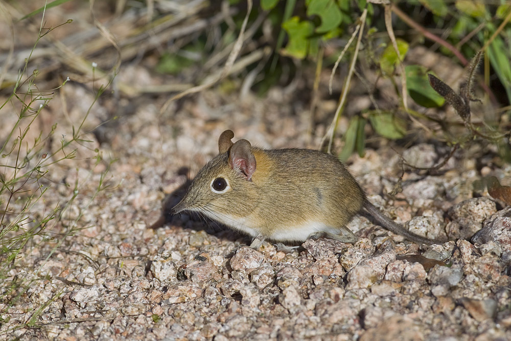
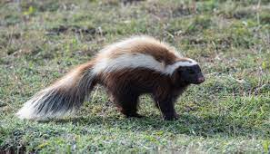

```{r setup, include=FALSE}
knitr::opts_chunk$set(echo = TRUE)
```


***

```{r message=FALSE}
library(tidyverse)
library(gt)
library(gmodels)
```


#  Encontrarán dos ejercicios de los análisis de Bondad de Ajuste.

## Ejercicio #1 

### Musaraña

Un total de 125 individuals de un mamifero pequeño, musaraña fueron localizado dentro de una jaula, con la misma cantidad de 6 diferentes comida, la frequencia de que cada una de las musaraña selecionarón un tipo de comida esta en la tabla

```{r, echo=FALSE, fig.show = "hold", out.width = "50%", fig.align = "default"}

```

Photo from: https://www.laguiadelvaron.com/wp-content/uploads/2020/08/reaparece-musarana-elefante-www.laguiadelvaron-1.jpg


```{r}
musaraña=tribble(
  ~Tipo_comida, ~frecuencia,
  "C1", 13,
  "C2", 26,
  "C3", 39,
  "C4", 14,
  "C5", 28
)
gt(musaraña)
```


Contesta las siguientes preguntas

 - a) Cual es el (son) valor(es) esperado para cada grupo.
 - b) Prueba si hay preferencia o no para una comida


```{r eval=FALSE, include=FALSE}
library(gmodels)
obs<-c(13, 26, 39, 14, 28)
esp<-c(.2,.2,.2,.2,.2)
chisq.test(x=obs, p=esp)
```

***

## Ejercicio #1 

### Mofetas y rabia

Los siguientes datos son las frecuencias de mofetas encontrada con rabia en dos diferentes región geográficas.


```{r, echo=FALSE, fig.show = "hold", out.width = "50%", fig.align = "default"}


R.version

```

Photo from: https://www.britannica.com/animal/skunk


```{r}
mofetas=tribble(
  ~TRegion, ~con_rabia, ~sin_rabia,
  "Region1", 14, 29,
  "Region2", 12, 38
  
)
gt(mofetas)
```


 - a) Cual es la hipótesis nula?
 - b) Conprueba la hipótesis para determinar si tener rabia es igual en las dos regiones?
 - c) Cual es el valor esperado de la mofetas sin rabia en la region 2? 

```{r, eval=FALSE, echo=FALSE}
#Crear la tabla de contingencia

con_rabia <- c(14, 29)
sin_rabia <- c(12,38)
Mofetatable <- cbind(con_rabia, sin_rabia)


rownames(Mofetatable)<-c("Region_1", "Region_2") # Añade el nombre a las filas

Mofetatable


CrossTable(Mofetatable, fisher = TRUE, chisq = TRUE, expected = TRUE, 
           sresid = TRUE, format = "SPSS")
```


## AHORA contesta las preguntas en MSTeam.

Hay una fecha limite para la entrega de los ejercicios.  

