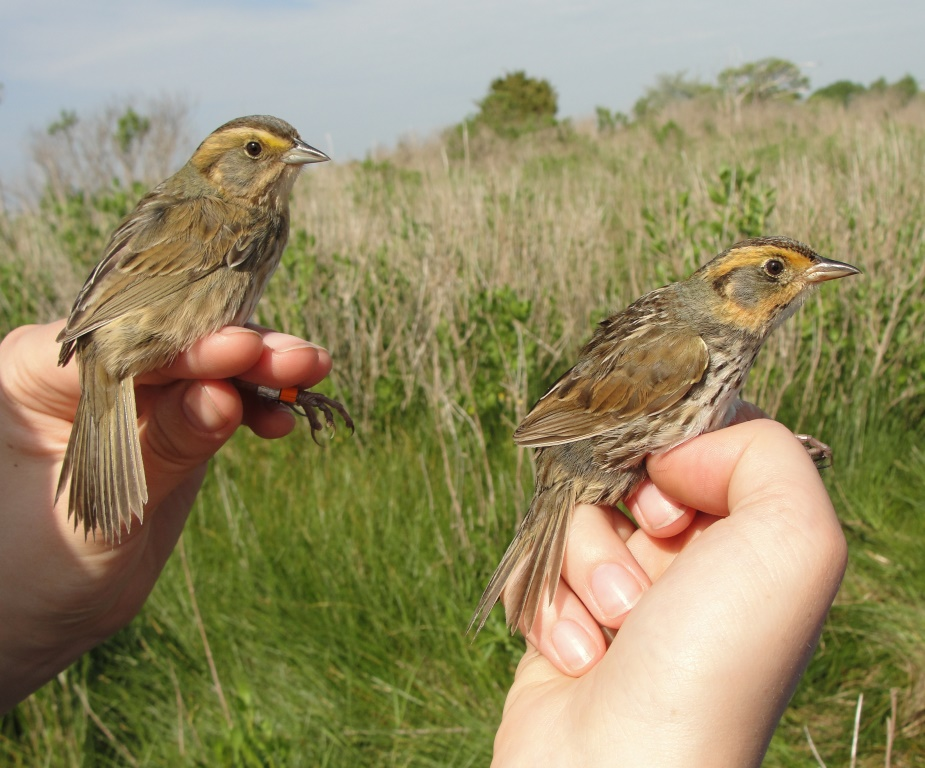

```{r setup, include=FALSE}
knitr::opts_chunk$set(echo = TRUE)
```

```{r CA}
library(tidyverse)
library(gt)
```


## Evaluación de distribución normal

Este documento tiene algunos ejercicios para evaluar si una distribución es normal. Los códigos (scripts) se encuentran en el archivo **T8 La Distribución Normal**. 
  
  Tema:
  
  - construir un histograma de los datos
  - sobreponer una distribución teórica sobre el histograma
  - evaluar si los datos tienen una distribución normal usando qqplot
  - evaluar se los datos tienen una distribución normal usando la prueba de Shaipro_Wilks y Anderson-Darling
    
    
## Construir un histograma con los siguientes datos
 
 1. Usa el paquete **ggversa**, y el archivo **SparrowsElphick** y haga un histograma de los pesos (wt) de los pajaros capturados
 

  
  
```{r C1, echo=FALSE, fig.show = "hold", out.width = "20%", fig.align = "default"}


```

 Foto de : https://birdcallsradio.com/episode-097-chris-elphick/
 

 
```{r, C2}
library(ggversa)
gt(head(SparrowsElphick))
```

***
 
 ### Constuye un histograma de la distribución de los pesos de los pajaros. 

  - las lineas blancas alrededor de las barras
  - que se cambio el nombre del eje de "x"
  - que se cambio el nombre del eje de "y"
 
```{r, C3, eval=FALSE, message=FALSE, warning=FALSE, include=FALSE}

ggplot(SparrowsElphick, aes(wt))+
         geom_histogram(colour="white")+
  ylab("Fecuencia")+
  xlab("Peso en gramos de los ")
```
 
***
 
Ahora a esta misma gráfica añádele la distribución normal teórica, el gráfico 


```{r, C4, eval=FALSE, message=FALSE, warning=FALSE, include=FALSE}

ggplot(SparrowsElphick, aes(wt))+
         geom_histogram(aes(y=..density..),colour="white")+
  ylab("Fecuencia")+
  xlab("Peso en gramos de los ")+
    stat_function(fun = dnorm, 
                args = list(mean = mean(SparrowsElphick$wt, na.rm = TRUE), 
                sd = sd(SparrowsElphick$wt, na.rm = TRUE)), 
                colour = "green", size = 1)
```

***

## QQPLOT


 - Ahora haz un gráfico de **qqplot** y determina si la distribución de los datos de peso de los finches tienen una distribución normal.

```{r, C5, eval=FALSE, message=FALSE, warning=FALSE, include=FALSE}
ggplot(SparrowsElphick, aes(sample=wt))+
  geom_qq()+
  geom_qq_line(colour="blue")
```

***
## Shapiro-Wilk test


 - Haz la prueba de Shapiro-Wilks para determinar si la distribución de los datos son significativamente diferente de una distribución normal.
 - Basado en los supuestos de esta prueba ¿Se debería utiliza la "Shapiro-Wilks" para evaluar la distribución normal.
 
 
#### Lograste tener este resultado?  
```{r eval=FALSE, message=FALSE, warning=FALSE, C6, echo=FALSE, include=FALSE}
shapiro.test(SparrowsElphick$wt)
length(SparrowsElphick$wt)
```

***

## Anderson-Darling

 - Haz la prueba de Anderson-Darling para determinar si la distribución de los datos son significativamente diferente de una distribución normal.

- ¿La distribución de los pesos es significativamente diferente de una distribución normal?


#### Lograste tener este resultado?
```{r eval=FALSE, message=FALSE, warning=FALSE, include=FALSE}
library(nortest)
ad.test(SparrowsElphick$wt)
```

***
