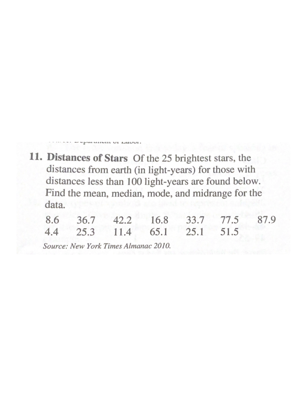
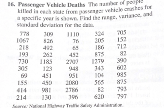

```{r setup, include=FALSE}
knitr::opts_chunk$set(echo = TRUE)
```


***

Calcular el promedio, mediana, moda y rango de los datos de las estrellas más cercana a la tierra


```{r echo=FALSE, out.width= "65%"}

```


***


Calular los cuantiles mencionado en la pregunta

```{r echo=FALSE, out.width= "65%"}

```

***

Calcular el promedio, mediana, moda de los datos de las estrellas más cercana a la tierra

```{r echo=FALSE, out.width= "65%"}

```


***

Calcular el rango, varianza, desviación estandard y error estandard


```{r echo=FALSE, out.width= "65%"}

```
