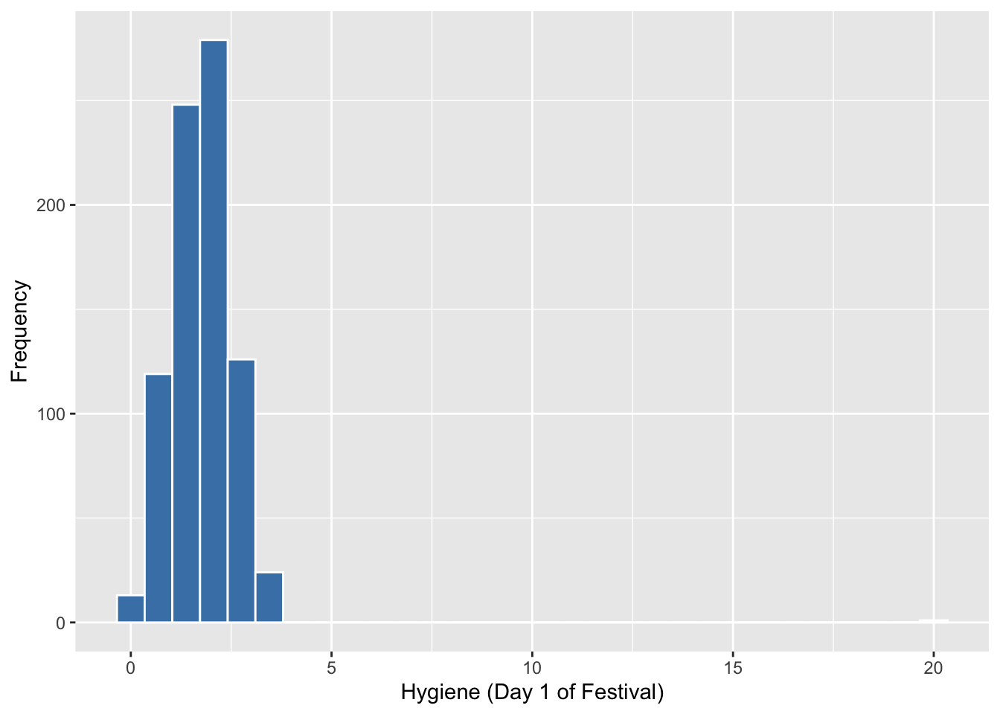
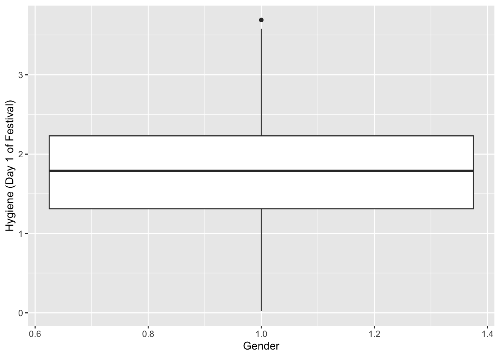
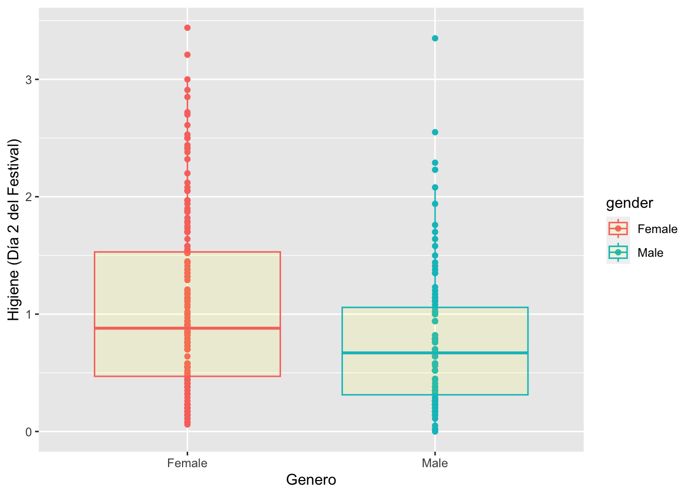

Fecha de la ultima revisión

```
## [1] "2020-07-23"
```


```r
library(ggplot2)
```

# Gráficos Básicos con ggplot2

Este modulo es una introducción corta para la visualización de los datos.  El paquete principal que se usa es el **ggplot2**.  La visualización de datos es un área especializado y no se podrá hacer justicia al tema al mismo tiempo que se estudia la estadística. Aquí se presenta es una introducción breve del tema.  La visualización ayuda a entender los datos ya que la dispersión de ellos impacta que prueba se puede utilizar y el significado de los analisis.   

La información utilizada en este documento proviene en parte del libro *Discovering Statistics using R* por Andy Field, Jeremy Miles y Zoë Field (2014).  

# Como crear una gráfica de regresión lineal usando ggplot

1.  Subir los datos "Exam Anxiety"
  Los archivos de datos que se usan en el libro se encuentran en este enlace, <https://studysites.sagepub.com/dsur/study/articles.htm>  


Seleccionar el archivo **Exam Anxiety**. Note que los datos a la hoja de datos tienen que abrirlo en Excel o otro programa y salvarlo en formato **.csv** antes de seguir los proximos pasos. El siguiente paso es poner el archivo de datos en su proyecto de RStudio.     
***
## Subir los datos a RStudio


```r
library(readr)
Exam_Anxiety <- read_csv("Data_files_csv/Exam Anxiety.csv")
```

Para visualizar las primeras y ultimas 6 filas usar **head()** y **tail()** respectivamente.  


```r
head(Exam_Anxiety)
```

```
## # A tibble: 6 x 5
##    Code Revise  Exam Anxiety Gender
##   <dbl>  <dbl> <dbl>   <dbl> <chr> 
## 1     1      4    40    86.3 Male  
## 2     2     11    65    88.7 Female
## 3     3     27    80    70.2 Male  
## 4     4     53    80    61.3 Male  
## 5     5      4    40    89.5 Male  
## 6     6     22    70    60.5 Female
```

```r
tail(Exam_Anxiety)
```

```
## # A tibble: 6 x 5
##    Code Revise  Exam Anxiety Gender
##   <dbl>  <dbl> <dbl>   <dbl> <chr> 
## 1    98     23    70    75.8 Male  
## 2    99     13    55    71.0 Female
## 3   100     14    75    78.2 Female
## 4   101      1     2    82.3 Male  
## 5   102      9    40    79.0 Male  
## 6   103     20    50    91.1 Female
```


Parta ver el nombre de las variables en el archivo se usa la función **names**. Vemos que hay cinco columnas, el **Code** que se refiere a un código que identifica el estudiante, **Revise** el tiempo que el estudiante estudio antes de tomar el examen, **Exam** la nota del estidiante, **Anxiety**, un indice de anxiedad antes de tomar el examen, **Gender** el genero del estudiante. 


```r
names(Exam_Anxiety)
```

```
## [1] "Code"    "Revise"  "Exam"    "Anxiety" "Gender"
```

***

# Regresión lineal

El primer gráfico es crear una regresión lineal. Para producir una regresión lineal se necesita dos variables con datos continuos Seleccionamos dos variables continua, el nivel de ansiedad y la nota del examen. Para hacer una regresión lineal que sigue el patrón de y=mx+b, hay que utilizar la función geom_smooth(method=lm), la función **lm** se refiere a modelo lineal o ingles **linear model**. Nota que con el programa ggplot2, hay que primero identificar de donde proviene los datos **Exam_Anxiety**, despúes que hay identificar cual; son las variables de este archivo que se van a utilizar, en este caso **y=Exam, x=Anxiety**.  El proximoo paso es determinar que tipo de gráfico, y este caso es una regresión lineal.     


```r
ggplot(Exam_Anxiety, aes(y=Exam, x=Anxiety))+ 
  geom_smooth(method=lm, colour="red")
```


***
## Añadiendo color por grupo y otras bellezas

En este archivo utilizaremos un archivo que se usa muy comúnmente en los análisis de R, para demostrar un análisis o como hacer gráfico.  El archivo se llama **iris** y contiene información sobre el tamaño de características florales de tres especies del genero *Iris*.  En este gráfico se añade cuatro componente suplementarios, 1) un puntos para cada par de valores **Sepal.Length, Petal.Length**, 2) se cambia los nombres de las leyendas en **y** y **x** con la función **labs()** = labels, 3) se añade un titulo al gráfico con **ggtitle()**, 4) Note que cada especies tiene un color distinto, esto fue muy fácil incluir añadiendo la función **col=Species**, lo que esto significa es que para cada especies de planta se pone un color diferente.  


```r
tail(iris)
```

```
##     Sepal.Length Sepal.Width Petal.Length Petal.Width   Species
## 145          6.7         3.3          5.7         2.5 virginica
## 146          6.7         3.0          5.2         2.3 virginica
## 147          6.3         2.5          5.0         1.9 virginica
## 148          6.5         3.0          5.2         2.0 virginica
## 149          6.2         3.4          5.4         2.3 virginica
## 150          5.9         3.0          5.1         1.8 virginica
```

```r
ggplot(iris, aes(Sepal.Length, Petal.Length)) +
      geom_point(aes(col = Species)) +
  geom_smooth(method="lm", colour="aquamarine") +  
  labs(x = "El largo del Sepalo", y = "El largo del Petalo")+
  ggtitle("Basic geom_point and linear regression")
```


***
## Salvar graficos con **ggsave**

Como salvar un gráfico para usarlo en otros programados o presentación por ejemplo de **MS Power Point**.  Se usa la función **ggsave()**.  se pone en comilla el nombre que se quiere dar a la figura y se identifica que tipo de archivo se quiere crear, por ejemplo (.tiff, .png, .tiff, .pdf). Nota que se salvo en un archivo que se llama "Graficos", es no es necesario, si no lo incluye sera salvado en el proyecto. 


```r
ggsave("Graficos/Iris_size.png")
```


# Regressión simple con puntos


```r
scatter <- ggplot(Exam_Anxiety, aes(Anxiety, Exam))
scatter + geom_point(shape=20, colour="red") + 
          geom_smooth(method = "lm", colour = "blue", se = F) +  # se = F, remueve el intervalo de confianza
  labs(x = "Exam Anxiety", y = "Exam Performance %")
```


# Regressión simple con puntos y intervalo de confianza


```r
scatter <- ggplot(Exam_Anxiety, aes(Anxiety, Exam))
scatter + geom_point() + 
          geom_smooth(method = "lm", colour = "Red")+ 
  labs(x = "Exam Anxiety", y = "Exam Performance %") 
```


### Cambio de color del intervalo de confianza 


```r
scatter <- ggplot(Exam_Anxiety, aes(Anxiety, Exam))
scatter + geom_point() + 
  geom_smooth(method = "lm", colour = "Red", alpha = 0.2, fill = "orange") + 
  labs(x = "Exam Anxiety", y = "Exam Performance %") 
```


***
## Regresión lineal por grupo.
Para separar y tener una linea por grupo se usa la función **colour** y se añade la variable de factor. En este caso la variable **Gender** para separar entre hombres y mujer.  Se enseña también la función **ggtitle()** para añadir un titulo al gráfico. 


```r
ggplot(Exam_Anxiety, aes(y=Exam, x=Anxiety, colour=Gender))+ 
  geom_point(colour="coral")+
  geom_smooth(method="lm") +  # lm (linear model) es para modelos lineales 
  labs(x = "Exam Anxiety Score", y = "Exam Performance %")+
  ggtitle("Basic geom_point and linear regression")
```


***

## Histogramas

Un histograma es un gráfico que representa la frecuencia de los valores de un conjunto de datos.  pro consecuencia es el eje de **x** se encuentra una variable continua y en el eje de **y** la frecuencia. La frecuencia es lo mismo que el cantidad de veces que aparece los valores en **x** en el conjunto de datos.  

Se necesita el archivo *DownloadFestival* que se encuentra debajo la pestaña de **Los Datos**. El ejemplo proviene de Field et al. (2014).  

    Una bióloga estaba preocupado por los posibles efectos sobre la salud de los que particpan a un festivales de música. Entonces, un año fue al Download Festival en el Reino Unido (Download Festival UK). Ella midió la higiene del los que participaron al concierto n= 810 durante el festival de 3 días. Cada día intentaba encontrar a todas las personas que censó el primer día. Los valores asignado fueron de 0 a 4 sobre el nivel de limpieza por como olia los participantes
    + 0 = hueles como un cadáver. 
    + 4 = hueles a rosas dulces en un fresco día de primavera
    

La hipótesis es que la higiene personal de los asistentes al concierto disminuiría dramáticamente durante los 3 días del festival.
 


```r
library(readr)
DownloadFestival <- read_csv("Data_files_csv/DownloadFestival.csv")

FD=DownloadFestival
```

Construyendo histogramas y detectando valores atípicos.  Nota los valores **NA**, estos son los participantes que no se pudieron encontrar en los siguientes días. 


```r
head(FD, n=2)
```

```
## # A tibble: 2 x 5
##   ticknumb gender  day1  day2  day3
##      <dbl> <chr>  <dbl> <dbl> <dbl>
## 1     2111 Male    2.64  1.35 1.61 
## 2     2229 Female  0.97  1.41 0.290
```

```r
tail(FD)
```

```
## # A tibble: 6 x 5
##   ticknumb gender  day1  day2  day3
##      <dbl> <chr>  <dbl> <dbl> <dbl>
## 1     4749 Female  0.52 NA       NA
## 2     4756 Female  2.91  0.94    NA
## 3     4758 Female  2.61  1.44    NA
## 4     4759 Female  1.47 NA       NA
## 5     4760 Male    1.28 NA       NA
## 6     4765 Female  1.26 NA       NA
```

Nota que aquí vemos el resultado, y encontramos un problema.  Hay participantes que tienen valores que no son entre 0 y 4, que es la escala de higiene.  Aunque es difícil ver, pero debido que el gráfico se extiende mayor de 4, es un indice de un problema ya que sabemos que los valores pueden estar solamente entre 0 y 4.  


```r
 ggplot(FD, aes(day1))+ 
  geom_histogram(colour="white", fill="steelblue") + 
  labs(x = "Hygiene (Day 1 of Festival)", y = "Frequency")
```



Evaluar los datos resumidos, para detectar porque el gráfico se extiende a valores mayor de 4. Nota que el día 1, el valor máximo es de 20. Este probablemente fue un error de poner los datos un la hoja de Excel.  Lo que se puede hacer es remover este participante del analisis.   


```r
summary(DownloadFestival)
```

```
##     ticknumb       gender               day1             day2       
##  Min.   :2111   Length:810         Min.   : 0.020   Min.   :0.0000  
##  1st Qu.:3096   Class :character   1st Qu.: 1.312   1st Qu.:0.4100  
##  Median :3620   Mode  :character   Median : 1.790   Median :0.7900  
##  Mean   :3616                      Mean   : 1.793   Mean   :0.9609  
##  3rd Qu.:4155                      3rd Qu.: 2.230   3rd Qu.:1.3500  
##  Max.   :4765                      Max.   :20.020   Max.   :3.4400  
##                                                     NA's   :546     
##       day3       
##  Min.   :0.0200  
##  1st Qu.:0.4400  
##  Median :0.7600  
##  Mean   :0.9765  
##  3rd Qu.:1.5250  
##  Max.   :3.4100  
##  NA's   :687
```


Se puede remueve valores de un conjunto de datos usando la función **subset( )** y en este caso de la columna **day1** se selecciona solamente los valores menor de 5, de esta forma eliminamos el valore de 20. 

Usamos otra vez **summary( )** para asegurarnos que se solucionó el problema. Ahora vemos que el valor máximo es 3.69.  


```r
Festivalday1=subset(DownloadFestival, day1<5)
summary(Festivalday1)
```

```
##     ticknumb       gender               day1            day2       
##  Min.   :2111   Length:809         Min.   :0.020   Min.   :0.0000  
##  1st Qu.:3096   Class :character   1st Qu.:1.310   1st Qu.:0.4100  
##  Median :3620   Mode  :character   Median :1.790   Median :0.7900  
##  Mean   :3616                      Mean   :1.771   Mean   :0.9553  
##  3rd Qu.:4154                      3rd Qu.:2.230   3rd Qu.:1.3350  
##  Max.   :4765                      Max.   :3.690   Max.   :3.4400  
##                                                    NA's   :546     
##       day3       
##  Min.   :0.0200  
##  1st Qu.:0.4400  
##  Median :0.7600  
##  Mean   :0.9765  
##  3rd Qu.:1.5250  
##  Max.   :3.4100  
##  NA's   :686
```

Ahora usando el nuevo data frame hacemos el gráfico otra vez


```r
festivalHistogram <- ggplot(Festivalday1, aes(day1))
festivalHistogram + 
  geom_histogram(fill="orange", colour="white") + 
  labs(x = "Hygiene (Day 1 of Festival)", y = "Frequency")
```


***

## Gráficos de caja **box plots**

Para crear un gráfico de caja se usa la función **geom_boxplot()**, si hay solamente un grupo en **x** se pone **x=1** y en la **y** la variable continua.  


```r
festivalBoxplot <- ggplot(Festivalday1, aes(x=1,y=day1))
festivalBoxplot + geom_boxplot() + labs(x = "Gender", y = "Hygiene (Day 1 of Festival)")
```



***

## Gráfico de caja por grupo

Para producir un gráfico de caja por multiples grupos en **x** se añade la variable categorica y en la **y** la variable continua. Si se quiere un color diferente por caja se usa la función **color** con el nombre en de la variable en **x**.   


```r
festivalBoxplot <- ggplot(Festivalday1, aes(x=gender,y=day2, colour=gender))
festivalBoxplot + 
  geom_point()+
  geom_boxplot(fill="yellow", alpha=0.1) + 
  labs(x = "Genero", y = "Higiene (Día 2 del Festival)")
```



***

# Detección valores sesgados o átipicos. 
En la función abajo denominado **Valoressesgados** uno puede determinar el porciento de valores que son sesgados.   Note que aquí la función no existe y se construye una función para calcularlos porcentajes. Si selecionamos uno de las columnas, el dia 3 del concierto. Vemos que hay 4% de los valores que estén por fuera del intervalo de 95%, y 2.4% de los valores que estén por encima del intervalo de confianza de 99%.  


```r
Valoressesgados<-function(variable, digits = 2){
  
  zvariable<-(variable-mean(variable, na.rm = TRUE))/sd(variable, na.rm = TRUE)
  
  IC95<-abs(zvariable) >= 1.96  # error de 95%
  IC99<-abs(zvariable) >= 2.58   # error de 99%
  IC999<-abs(zvariable) >= 3.29  # error de 99.9%
  
  ncases<-length(na.omit(zvariable))
  
  percentaje95<-round(100*length(subset(IC95, IC95 == TRUE))/ncases, digits)
  percentaje99<-round(100*length(subset(IC99, IC99 == TRUE))/ncases, digits)
  percentaje999<-round(100*length(subset(IC999, IC999 == TRUE))/ncases, digits)
  
  cat("Valor absoluto z-score mayor de 1.96 = ", percentaje95, "%", "\n")
  cat("Valor absoluto z-score mayor de 2.58 = ",  percentaje99, "%", "\n")
  cat("Valor absoluto z-score mayor de 3.29 = ",  percentaje999, "%", "\n")
}

Valoressesgados(FD$day3)
```

```
## Valor absoluto z-score mayor de 1.96 =  4.07 % 
## Valor absoluto z-score mayor de 2.58 =  2.44 % 
## Valor absoluto z-score mayor de 3.29 =  0.81 %
```


***


# Gráficos de línea y errores

1. Learn how to reformat data in the correct type of data frame (as the original data set is not in the correct format) with the function "stack"
2. How to add the mean of the variable with "stat_summary"
2. How to connect the mean with a line and change color
3. how to add the error bars and color (The 95% confidence intervals, created with the stat_summary() function and the "mean_cl_boot" argument are bootstrap confidence intervals using the smean.cl.boot() function in Hmisc)

Installar la library(Hmisc)


```r
library(Hmisc) # Se necesita este paquete para poner los intervalos de confianza

library(readr)
Hiccups <- read_csv("Data_files_csv/Hiccups.csv")
head(Hiccups, n=2)
```

```
## # A tibble: 2 x 4
##   Baseline Tongue Carotid Rectum
##      <dbl>  <dbl>   <dbl>  <dbl>
## 1       15      9       7      2
## 2       13     18       7      4
```

Es necesario re-organizar los datos, ya que las 4 diferentes variables están diferentes columnas, necesitamos que están todos los datos en una columna.  Se usa la función **stack**.  Subseguientemente se asigna un nombre nuevo a las columnas


```r
hiccups<-stack(Hiccups) # organizar los datos en dos columnas con la función **stack**


names(hiccups)=c("Num_Hiccups","Intervention") # Cambiar el nombre de las columnas

head(hiccups)
```

```
##   Num_Hiccups Intervention
## 1          15     Baseline
## 2          13     Baseline
## 3           9     Baseline
## 4           7     Baseline
## 5          11     Baseline
## 6          14     Baseline
```

***

## La función **stat_summary** para calcular indices sumativos.  

Nota aquí que el promedio, *mean* es añadido como un punto y que están uniido tambien por una linea, están añadido al eje de **y** con la función **fun.y**.  Los intervalos de confianza se añaden con la función **fun.data=mean_cl_boot** y **geom="errorbar**.   


```r
ggplot(hiccups, aes(y=Num_Hiccups,x=Intervention))+ 
  stat_summary(fun.y = "mean", geom = "point") + 
  stat_summary(fun.y = "mean", geom = "line", aes(group = 1),colour = "Red", linetype = "dashed") +      
  stat_summary(fun.data = mean_cl_boot, geom = "errorbar", width = 0.2, colour="blue") + 
  labs(x = "Intervention", y = "Mean Number of Hiccups")
```


