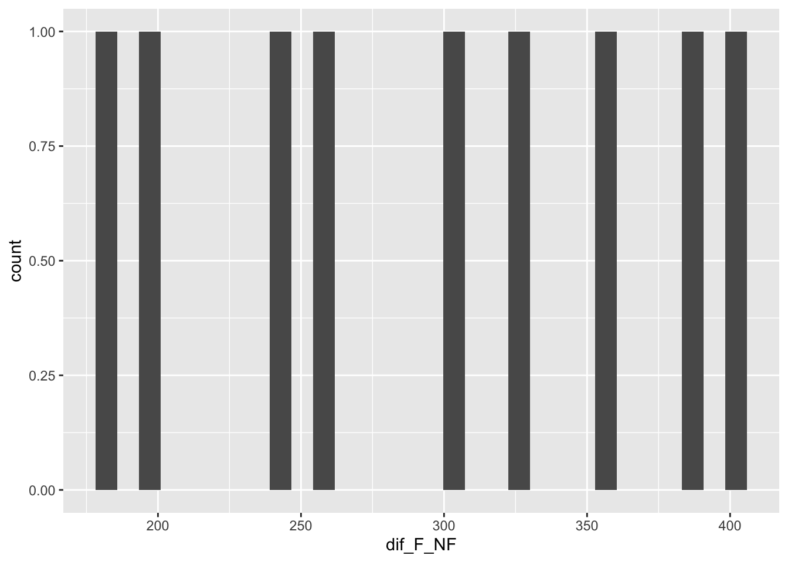

Fecha de la ultima revisión

```
## [1] "2023-07-10"
```


# Datos dependientes

Si tienes datos que no son independiente, es necesario usar la prueba con datos pareados (paired t-test). Cuando se refiere a datos no independiente es que hay evidencia que los datos pueden estar relacionado de una forma. En el siguiente ejemplo tenemos la altura de los padres y el altura de el hijo.  Hay evidencia que la genética influencia la altura de los humanos, también hay el ambiente.  Si el ambiente (nutrición, etc) es la única variable que tiene influencia sobre la altura pudiese que no se debería encontrar una relación entre la altura del padre y el hijo. Si la genética es la única variable que impacta la altura de los humanos, en este caso deberíamos encontrar una muy fuerte correlación entre la alturas de los padres y los hijos. 


Los datos provienen del paquete **UsingR** y el archivo se llama **father.son**

Primero mire los datos y los nombres de las variables. 


Paired Two-Sample T-test


```
##    fheight  sheight
## 1 65.04851 59.77827
## 2 63.25094 63.21404
## 3 64.95532 63.34242
## 4 65.75250 62.79238
## 5 61.13723 64.28113
## 6 63.02254 64.24221
```

***
## Visualizar la correlación

Antes de hacer la prueba es recomendado hacer un gráfico de puntos para visualizar los datos y observar si hay un patrón. Vemos a medida que aumenta la altura de los padres los hijos tienden a estar más altos.  parece que hay una correlación en la altura de los hijos basado en la altura del padre. Por consecuencia la altura de los hijos no son independiente de la altura de los padres.  Aunque hay evidencia que el ambiente, tal como el acceso a recursos (comida, leche, etc) tiene impacto sobre la altura de los humanos, la genética también tiene impacto to sobre la altura de los humanos. 


<!-- -->

***

# La prueba de t-pareado

La prueba de t-con datos pareados es la misma que la prueba de t con un grupo, **t.test()**.  

La hipótesis nula es que la diferencia entre los datos dependientes es igual a cero. La **d** se refiere a la diferencia entre los pares de datos.  Nota entonces que el análisis se hace evaluando si el promedio de las diferencias es igual a cero.  Nota que el valor de t es absoluto $\left|t\right|$, un valor negativo es igual que un valor positivo. 

  + Ho: $\overline{x_d}=0$
  + Ha: $\overline{x_d}≠0$

La prueba de t con datos pareados. 

$$\left|t\right|=\bar{\frac{d}{\frac{s_d}{\sqrt{n}}}}$$

Si el valor absoluto de las estadísticas de la prueba $\begin{array}{l}t=\left|t\right|\\\end{array}$ es mayor que el valor crítico, entonces la diferencia es significativa. El nivel critico del valor **p** corresponde al indicado en la tabla de la prueba tomando en cuanta el grado de libertad, la cantidad de error I y si es de un lado o ambos lados.


Las opciones para esta prueba son las siguientes en roja

  + t.test(<span style='color: red;'>x</span>, <span style='color: red;'>y</span>,
    + <span style='color: red;'>alternative = c(two.sided, less, greater)</span>,
    +  mu =, <span style='color: red;'>paired = FALSE</span>, var.equal = FALSE,
    +  <span style='color: red;'>conf.level = 0.95</span>, ...).

El resultado:  El valor de $\left|t\right|$ observado es de 11.789, con un grado de libertad de 1077 (n=1078), y un valor de p <0.0001. Por consecuencia se rechaza la hipótesis nula y se acepta la alterna. El intervalo de confianza del promedio es -1.163 a -0.831, con un promedio de -0.99. Esto significa que los padres tiende a estar una pulgada (-0.99) más bajo que los hijos. 


```
## 
## 	Paired t-test
## 
## data:  father.son$fheight and father.son$sheight
## t = -11.789, df = 1077, p-value < 2.2e-16
## alternative hypothesis: true mean difference is not equal to 0
## 95 percent confidence interval:
##  -1.1629160 -0.8310296
## sample estimates:
## mean difference 
##      -0.9969728
```

***
## Visualizar la diferencias


Podemos visualizar la diferencia entre los hijos y los padres.  Vemos el promedio si no tuviese diferencia (la linea azul), esto es nuestra hipótesis nula, y el estimado (el promedio de la diferencias es rojo, con el intervalo de confianza en las lineas entrecortada).  Si nuestro estimado (el intervalo de confianza de 95%) hubiese incluido la linea azul la prueba no seria significativa, y se aceptaría la hipótesis nula. 

<!-- -->

***

### Supuesto de normalidad

Cual metodo para determinar si las diferencias cumple normalidad?


***

# Paired t-test, Números de niños abuela y madre

## Ejercicio de clase
 

Vamos a evaluar si la cantidad de hijos cambia entre su abuela y su madre.  

```
##    abuela madre
## 1       3     2
## 2       3     2
## 3       2     2
## 4       3     3
## 5       5     3
## 6       3     3
## 7       2     2
## 8       3     3
## 9       4     1
## 10      3     2
## 11      4     2
```

```
##    abuela madre diff
## 1       3     2    1
## 2       3     2    1
## 3       2     2    0
## 4       3     3    0
## 5       5     3    2
## 6       3     3    0
## 7       2     2    0
## 8       3     3    0
## 9       4     1    3
## 10      3     2    1
## 11      4     2    2
```

```
## [1] 0.9090909
```

```
## 
## 	Paired t-test
## 
## data:  df$abuela and df$madre
## t = 2.8868, df = 10, p-value = 0.0162
## alternative hypothesis: true mean difference is not equal to 0
## 95 percent confidence interval:
##  0.2074091 1.6107727
## sample estimates:
## mean difference 
##       0.9090909
```


***

# Cultivador de Toronjas con parcelas pareadas

Un cultivador heredo 18 parcelas donde hay árboles de toronjas cada una en diferentes municipios.  El quiere saber si al añadir abono, la cosecha de toronjas aumenta.  El podría decidir que de seleccionar 9 de estas parcelas y añadir abono y las otras 9 sin abono.  El problema con este diseño experimental es que es bien conocido que el suelo varia de un sitio a otro y que el clima varia también.  Es más apropiado que el divide cada parcela en 2, y que la mitad recibe el abono y la otra mitad sirva de control (sin abono).  Cual sera el efecto del abono sobre la producción de toronjas en parcelas pareadas en Puerto Rico. 

La cantidad de Toronjas producidas por árbol en fincas pareadas, cada finca tiene una parcela con abono y la otra la otra parcela sin abono. Tenemos 18 diferentes sitios en PR donde se probo el efecto del abono sobre la producción de toronjas, se enseña solamente los primeros 8 pares de valores en la tabla. Cada parcela es del mismo tamaño con la misma cantidad de arboles. Los datos completos están en el próximo chunk.  


```{=html}
<table class="huxtable" style="border-collapse: collapse; border: 0px; margin-bottom: 2em; margin-top: 2em; ; margin-left: auto; margin-right: auto;  " id="tab:toronja">
<col><col><col><tr>
<th style="vertical-align: top; text-align: right; white-space: normal; border-style: solid solid solid solid; border-width: 0.4pt 0pt 0.4pt 0.4pt;    padding: 6pt 6pt 6pt 6pt; font-weight: bold;">Fertilizante</th><th style="vertical-align: top; text-align: right; white-space: normal; border-style: solid solid solid solid; border-width: 0.4pt 0pt 0.4pt 0pt;    padding: 6pt 6pt 6pt 6pt; font-weight: bold;">Sin_Fertilizante</th><th style="vertical-align: top; text-align: left; white-space: normal; border-style: solid solid solid solid; border-width: 0.4pt 0.4pt 0.4pt 0pt;    padding: 6pt 6pt 6pt 6pt; font-weight: bold;">Municipio</th></tr>
<tr>
<td style="vertical-align: top; text-align: right; white-space: normal; border-style: solid solid solid solid; border-width: 0.4pt 0pt 0pt 0.4pt;    padding: 6pt 6pt 6pt 6pt; background-color: rgb(242, 242, 242); font-weight: normal;">2.25e+03</td><td style="vertical-align: top; text-align: right; white-space: normal; border-style: solid solid solid solid; border-width: 0.4pt 0pt 0pt 0pt;    padding: 6pt 6pt 6pt 6pt; background-color: rgb(242, 242, 242); font-weight: normal;">1.92e+03</td><td style="vertical-align: top; text-align: left; white-space: normal; border-style: solid solid solid solid; border-width: 0.4pt 0.4pt 0pt 0pt;    padding: 6pt 6pt 6pt 6pt; background-color: rgb(242, 242, 242); font-weight: normal;">Utuado</td></tr>
<tr>
<td style="vertical-align: top; text-align: right; white-space: normal; border-style: solid solid solid solid; border-width: 0pt 0pt 0pt 0.4pt;    padding: 6pt 6pt 6pt 6pt; font-weight: normal;">2.41e+03</td><td style="vertical-align: top; text-align: right; white-space: normal; border-style: solid solid solid solid; border-width: 0pt 0pt 0pt 0pt;    padding: 6pt 6pt 6pt 6pt; font-weight: normal;">2.02e+03</td><td style="vertical-align: top; text-align: left; white-space: normal; border-style: solid solid solid solid; border-width: 0pt 0.4pt 0pt 0pt;    padding: 6pt 6pt 6pt 6pt; font-weight: normal;">Cabo Rojo</td></tr>
<tr>
<td style="vertical-align: top; text-align: right; white-space: normal; border-style: solid solid solid solid; border-width: 0pt 0pt 0pt 0.4pt;    padding: 6pt 6pt 6pt 6pt; background-color: rgb(242, 242, 242); font-weight: normal;">2.26e+03</td><td style="vertical-align: top; text-align: right; white-space: normal; border-style: solid solid solid solid; border-width: 0pt 0pt 0pt 0pt;    padding: 6pt 6pt 6pt 6pt; background-color: rgb(242, 242, 242); font-weight: normal;">2.06e+03</td><td style="vertical-align: top; text-align: left; white-space: normal; border-style: solid solid solid solid; border-width: 0pt 0.4pt 0pt 0pt;    padding: 6pt 6pt 6pt 6pt; background-color: rgb(242, 242, 242); font-weight: normal;">Manati</td></tr>
<tr>
<td style="vertical-align: top; text-align: right; white-space: normal; border-style: solid solid solid solid; border-width: 0pt 0pt 0pt 0.4pt;    padding: 6pt 6pt 6pt 6pt; font-weight: normal;">2.2e+03&nbsp;</td><td style="vertical-align: top; text-align: right; white-space: normal; border-style: solid solid solid solid; border-width: 0pt 0pt 0pt 0pt;    padding: 6pt 6pt 6pt 6pt; font-weight: normal;">1.96e+03</td><td style="vertical-align: top; text-align: left; white-space: normal; border-style: solid solid solid solid; border-width: 0pt 0.4pt 0pt 0pt;    padding: 6pt 6pt 6pt 6pt; font-weight: normal;">Yabucoa</td></tr>
<tr>
<td style="vertical-align: top; text-align: right; white-space: normal; border-style: solid solid solid solid; border-width: 0pt 0pt 0pt 0.4pt;    padding: 6pt 6pt 6pt 6pt; background-color: rgb(242, 242, 242); font-weight: normal;">2.36e+03</td><td style="vertical-align: top; text-align: right; white-space: normal; border-style: solid solid solid solid; border-width: 0pt 0pt 0pt 0pt;    padding: 6pt 6pt 6pt 6pt; background-color: rgb(242, 242, 242); font-weight: normal;">1.96e+03</td><td style="vertical-align: top; text-align: left; white-space: normal; border-style: solid solid solid solid; border-width: 0pt 0.4pt 0pt 0pt;    padding: 6pt 6pt 6pt 6pt; background-color: rgb(242, 242, 242); font-weight: normal;">Humacao</td></tr>
<tr>
<td style="vertical-align: top; text-align: right; white-space: normal; border-style: solid solid solid solid; border-width: 0pt 0pt 0pt 0.4pt;    padding: 6pt 6pt 6pt 6pt; font-weight: normal;">2.32e+03</td><td style="vertical-align: top; text-align: right; white-space: normal; border-style: solid solid solid solid; border-width: 0pt 0pt 0pt 0pt;    padding: 6pt 6pt 6pt 6pt; font-weight: normal;">2.14e+03</td><td style="vertical-align: top; text-align: left; white-space: normal; border-style: solid solid solid solid; border-width: 0pt 0.4pt 0pt 0pt;    padding: 6pt 6pt 6pt 6pt; font-weight: normal;">Caguas</td></tr>
<tr>
<td style="vertical-align: top; text-align: right; white-space: normal; border-style: solid solid solid solid; border-width: 0pt 0pt 0pt 0.4pt;    padding: 6pt 6pt 6pt 6pt; background-color: rgb(242, 242, 242); font-weight: normal;">2.24e+03</td><td style="vertical-align: top; text-align: right; white-space: normal; border-style: solid solid solid solid; border-width: 0pt 0pt 0pt 0pt;    padding: 6pt 6pt 6pt 6pt; background-color: rgb(242, 242, 242); font-weight: normal;">1.98e+03</td><td style="vertical-align: top; text-align: left; white-space: normal; border-style: solid solid solid solid; border-width: 0pt 0.4pt 0pt 0pt;    padding: 6pt 6pt 6pt 6pt; background-color: rgb(242, 242, 242); font-weight: normal;">San Juan</td></tr>
<tr>
<td style="vertical-align: top; text-align: right; white-space: normal; border-style: solid solid solid solid; border-width: 0pt 0pt 0pt 0.4pt;    padding: 6pt 6pt 6pt 6pt; font-weight: normal;">2.3e+03&nbsp;</td><td style="vertical-align: top; text-align: right; white-space: normal; border-style: solid solid solid solid; border-width: 0pt 0pt 0pt 0pt;    padding: 6pt 6pt 6pt 6pt; font-weight: normal;">1.94e+03</td><td style="vertical-align: top; text-align: left; white-space: normal; border-style: solid solid solid solid; border-width: 0pt 0.4pt 0pt 0pt;    padding: 6pt 6pt 6pt 6pt; font-weight: normal;">Jayuya</td></tr>
<tr>
<td style="vertical-align: top; text-align: right; white-space: normal; border-style: solid solid solid solid; border-width: 0pt 0pt 0.4pt 0.4pt;    padding: 6pt 6pt 6pt 6pt; background-color: rgb(242, 242, 242); font-weight: normal;">2.09e+03</td><td style="vertical-align: top; text-align: right; white-space: normal; border-style: solid solid solid solid; border-width: 0pt 0pt 0.4pt 0pt;    padding: 6pt 6pt 6pt 6pt; background-color: rgb(242, 242, 242); font-weight: normal;">1.79e+03</td><td style="vertical-align: top; text-align: left; white-space: normal; border-style: solid solid solid solid; border-width: 0pt 0.4pt 0.4pt 0pt;    padding: 6pt 6pt 6pt 6pt; background-color: rgb(242, 242, 242); font-weight: normal;">Ponce</td></tr>
</table>

```

```{=html}
<table class="huxtable" style="border-collapse: collapse; border: 0px; margin-bottom: 2em; margin-top: 2em; ; margin-left: auto; margin-right: auto;  " id="tab:toronja">
<col><col><col><col><tr>
<th style="vertical-align: top; text-align: right; white-space: normal; border-style: solid solid solid solid; border-width: 0.4pt 0pt 0.4pt 0.4pt;    padding: 6pt 6pt 6pt 6pt; font-weight: bold;">Fertilizante</th><th style="vertical-align: top; text-align: right; white-space: normal; border-style: solid solid solid solid; border-width: 0.4pt 0pt 0.4pt 0pt;    padding: 6pt 6pt 6pt 6pt; font-weight: bold;">Sin_Fertilizante</th><th style="vertical-align: top; text-align: left; white-space: normal; border-style: solid solid solid solid; border-width: 0.4pt 0pt 0.4pt 0pt;    padding: 6pt 6pt 6pt 6pt; font-weight: bold;">Municipio</th><th style="vertical-align: top; text-align: right; white-space: normal; border-style: solid solid solid solid; border-width: 0.4pt 0.4pt 0.4pt 0pt;    padding: 6pt 6pt 6pt 6pt; font-weight: bold;">dif_F_NF</th></tr>
<tr>
<td style="vertical-align: top; text-align: right; white-space: normal; border-style: solid solid solid solid; border-width: 0.4pt 0pt 0pt 0.4pt;    padding: 6pt 6pt 6pt 6pt; background-color: rgb(242, 242, 242); font-weight: normal;">2.25e+03</td><td style="vertical-align: top; text-align: right; white-space: normal; border-style: solid solid solid solid; border-width: 0.4pt 0pt 0pt 0pt;    padding: 6pt 6pt 6pt 6pt; background-color: rgb(242, 242, 242); font-weight: normal;">1.92e+03</td><td style="vertical-align: top; text-align: left; white-space: normal; border-style: solid solid solid solid; border-width: 0.4pt 0pt 0pt 0pt;    padding: 6pt 6pt 6pt 6pt; background-color: rgb(242, 242, 242); font-weight: normal;">Utuado</td><td style="vertical-align: top; text-align: right; white-space: normal; border-style: solid solid solid solid; border-width: 0.4pt 0.4pt 0pt 0pt;    padding: 6pt 6pt 6pt 6pt; background-color: rgb(242, 242, 242); font-weight: normal;">330</td></tr>
<tr>
<td style="vertical-align: top; text-align: right; white-space: normal; border-style: solid solid solid solid; border-width: 0pt 0pt 0pt 0.4pt;    padding: 6pt 6pt 6pt 6pt; font-weight: normal;">2.41e+03</td><td style="vertical-align: top; text-align: right; white-space: normal; border-style: solid solid solid solid; border-width: 0pt 0pt 0pt 0pt;    padding: 6pt 6pt 6pt 6pt; font-weight: normal;">2.02e+03</td><td style="vertical-align: top; text-align: left; white-space: normal; border-style: solid solid solid solid; border-width: 0pt 0pt 0pt 0pt;    padding: 6pt 6pt 6pt 6pt; font-weight: normal;">Cabo Rojo</td><td style="vertical-align: top; text-align: right; white-space: normal; border-style: solid solid solid solid; border-width: 0pt 0.4pt 0pt 0pt;    padding: 6pt 6pt 6pt 6pt; font-weight: normal;">390</td></tr>
<tr>
<td style="vertical-align: top; text-align: right; white-space: normal; border-style: solid solid solid solid; border-width: 0pt 0pt 0pt 0.4pt;    padding: 6pt 6pt 6pt 6pt; background-color: rgb(242, 242, 242); font-weight: normal;">2.26e+03</td><td style="vertical-align: top; text-align: right; white-space: normal; border-style: solid solid solid solid; border-width: 0pt 0pt 0pt 0pt;    padding: 6pt 6pt 6pt 6pt; background-color: rgb(242, 242, 242); font-weight: normal;">2.06e+03</td><td style="vertical-align: top; text-align: left; white-space: normal; border-style: solid solid solid solid; border-width: 0pt 0pt 0pt 0pt;    padding: 6pt 6pt 6pt 6pt; background-color: rgb(242, 242, 242); font-weight: normal;">Manati</td><td style="vertical-align: top; text-align: right; white-space: normal; border-style: solid solid solid solid; border-width: 0pt 0.4pt 0pt 0pt;    padding: 6pt 6pt 6pt 6pt; background-color: rgb(242, 242, 242); font-weight: normal;">200</td></tr>
<tr>
<td style="vertical-align: top; text-align: right; white-space: normal; border-style: solid solid solid solid; border-width: 0pt 0pt 0pt 0.4pt;    padding: 6pt 6pt 6pt 6pt; font-weight: normal;">2.2e+03&nbsp;</td><td style="vertical-align: top; text-align: right; white-space: normal; border-style: solid solid solid solid; border-width: 0pt 0pt 0pt 0pt;    padding: 6pt 6pt 6pt 6pt; font-weight: normal;">1.96e+03</td><td style="vertical-align: top; text-align: left; white-space: normal; border-style: solid solid solid solid; border-width: 0pt 0pt 0pt 0pt;    padding: 6pt 6pt 6pt 6pt; font-weight: normal;">Yabucoa</td><td style="vertical-align: top; text-align: right; white-space: normal; border-style: solid solid solid solid; border-width: 0pt 0.4pt 0pt 0pt;    padding: 6pt 6pt 6pt 6pt; font-weight: normal;">240</td></tr>
<tr>
<td style="vertical-align: top; text-align: right; white-space: normal; border-style: solid solid solid solid; border-width: 0pt 0pt 0pt 0.4pt;    padding: 6pt 6pt 6pt 6pt; background-color: rgb(242, 242, 242); font-weight: normal;">2.36e+03</td><td style="vertical-align: top; text-align: right; white-space: normal; border-style: solid solid solid solid; border-width: 0pt 0pt 0pt 0pt;    padding: 6pt 6pt 6pt 6pt; background-color: rgb(242, 242, 242); font-weight: normal;">1.96e+03</td><td style="vertical-align: top; text-align: left; white-space: normal; border-style: solid solid solid solid; border-width: 0pt 0pt 0pt 0pt;    padding: 6pt 6pt 6pt 6pt; background-color: rgb(242, 242, 242); font-weight: normal;">Humacao</td><td style="vertical-align: top; text-align: right; white-space: normal; border-style: solid solid solid solid; border-width: 0pt 0.4pt 0pt 0pt;    padding: 6pt 6pt 6pt 6pt; background-color: rgb(242, 242, 242); font-weight: normal;">400</td></tr>
<tr>
<td style="vertical-align: top; text-align: right; white-space: normal; border-style: solid solid solid solid; border-width: 0pt 0pt 0pt 0.4pt;    padding: 6pt 6pt 6pt 6pt; font-weight: normal;">2.32e+03</td><td style="vertical-align: top; text-align: right; white-space: normal; border-style: solid solid solid solid; border-width: 0pt 0pt 0pt 0pt;    padding: 6pt 6pt 6pt 6pt; font-weight: normal;">2.14e+03</td><td style="vertical-align: top; text-align: left; white-space: normal; border-style: solid solid solid solid; border-width: 0pt 0pt 0pt 0pt;    padding: 6pt 6pt 6pt 6pt; font-weight: normal;">Caguas</td><td style="vertical-align: top; text-align: right; white-space: normal; border-style: solid solid solid solid; border-width: 0pt 0.4pt 0pt 0pt;    padding: 6pt 6pt 6pt 6pt; font-weight: normal;">180</td></tr>
<tr>
<td style="vertical-align: top; text-align: right; white-space: normal; border-style: solid solid solid solid; border-width: 0pt 0pt 0pt 0.4pt;    padding: 6pt 6pt 6pt 6pt; background-color: rgb(242, 242, 242); font-weight: normal;">2.24e+03</td><td style="vertical-align: top; text-align: right; white-space: normal; border-style: solid solid solid solid; border-width: 0pt 0pt 0pt 0pt;    padding: 6pt 6pt 6pt 6pt; background-color: rgb(242, 242, 242); font-weight: normal;">1.98e+03</td><td style="vertical-align: top; text-align: left; white-space: normal; border-style: solid solid solid solid; border-width: 0pt 0pt 0pt 0pt;    padding: 6pt 6pt 6pt 6pt; background-color: rgb(242, 242, 242); font-weight: normal;">San Juan</td><td style="vertical-align: top; text-align: right; white-space: normal; border-style: solid solid solid solid; border-width: 0pt 0.4pt 0pt 0pt;    padding: 6pt 6pt 6pt 6pt; background-color: rgb(242, 242, 242); font-weight: normal;">260</td></tr>
<tr>
<td style="vertical-align: top; text-align: right; white-space: normal; border-style: solid solid solid solid; border-width: 0pt 0pt 0pt 0.4pt;    padding: 6pt 6pt 6pt 6pt; font-weight: normal;">2.3e+03&nbsp;</td><td style="vertical-align: top; text-align: right; white-space: normal; border-style: solid solid solid solid; border-width: 0pt 0pt 0pt 0pt;    padding: 6pt 6pt 6pt 6pt; font-weight: normal;">1.94e+03</td><td style="vertical-align: top; text-align: left; white-space: normal; border-style: solid solid solid solid; border-width: 0pt 0pt 0pt 0pt;    padding: 6pt 6pt 6pt 6pt; font-weight: normal;">Jayuya</td><td style="vertical-align: top; text-align: right; white-space: normal; border-style: solid solid solid solid; border-width: 0pt 0.4pt 0pt 0pt;    padding: 6pt 6pt 6pt 6pt; font-weight: normal;">360</td></tr>
<tr>
<td style="vertical-align: top; text-align: right; white-space: normal; border-style: solid solid solid solid; border-width: 0pt 0pt 0.4pt 0.4pt;    padding: 6pt 6pt 6pt 6pt; background-color: rgb(242, 242, 242); font-weight: normal;">2.09e+03</td><td style="vertical-align: top; text-align: right; white-space: normal; border-style: solid solid solid solid; border-width: 0pt 0pt 0.4pt 0pt;    padding: 6pt 6pt 6pt 6pt; background-color: rgb(242, 242, 242); font-weight: normal;">1.79e+03</td><td style="vertical-align: top; text-align: left; white-space: normal; border-style: solid solid solid solid; border-width: 0pt 0pt 0.4pt 0pt;    padding: 6pt 6pt 6pt 6pt; background-color: rgb(242, 242, 242); font-weight: normal;">Ponce</td><td style="vertical-align: top; text-align: right; white-space: normal; border-style: solid solid solid solid; border-width: 0pt 0.4pt 0.4pt 0pt;    padding: 6pt 6pt 6pt 6pt; background-color: rgb(242, 242, 242); font-weight: normal;">300</td></tr>
</table>

```
<!-- -->
```{=html}
<table class="huxtable" style="border-collapse: collapse; border: 0px; margin-bottom: 2em; margin-top: 2em; ; margin-left: auto; margin-right: auto;  " id="tab:toronja">
<caption style="caption-side: top; text-align: center;">La cantidad de toronjas producidas en parceles en diferentes municipios</caption><col><col><col><col><tr>
<th style="vertical-align: top; text-align: right; white-space: normal; border-style: solid solid solid solid; border-width: 0.4pt 0pt 1pt 0pt;    padding: 6pt 6pt 6pt 0pt; font-weight: bold;">Fertilizante</th><th style="vertical-align: top; text-align: right; white-space: normal; border-style: solid solid solid solid; border-width: 0.4pt 0pt 1pt 0pt;    padding: 6pt 6pt 6pt 6pt; font-weight: bold;">Sin_Fertilizante</th><th style="vertical-align: top; text-align: left; white-space: normal; border-style: solid solid solid solid; border-width: 0.4pt 0pt 1pt 0pt;    padding: 6pt 6pt 6pt 6pt; font-weight: bold;">Municipio</th><th style="vertical-align: top; text-align: right; white-space: normal; border-style: solid solid solid solid; border-width: 0.4pt 0pt 1pt 0pt;    padding: 6pt 0pt 6pt 6pt; font-weight: bold;">dif_F_NF</th></tr>
<tr>
<td style="vertical-align: top; text-align: right; white-space: normal; border-style: solid solid solid solid; border-width: 1pt 0pt 0pt 0pt;    padding: 6pt 6pt 6pt 0pt; font-weight: normal;">2.25e+03</td><td style="vertical-align: top; text-align: right; white-space: normal; border-style: solid solid solid solid; border-width: 1pt 0pt 0pt 0pt;    padding: 6pt 6pt 6pt 6pt; font-weight: normal;">1.92e+03</td><td style="vertical-align: top; text-align: left; white-space: normal; border-style: solid solid solid solid; border-width: 1pt 0pt 0pt 0pt;    padding: 6pt 6pt 6pt 6pt; font-weight: normal;">Utuado</td><td style="vertical-align: top; text-align: right; white-space: normal; border-style: solid solid solid solid; border-width: 1pt 0pt 0pt 0pt;    padding: 6pt 0pt 6pt 6pt; font-weight: normal;">330</td></tr>
<tr>
<td style="vertical-align: top; text-align: right; white-space: normal; border-style: solid solid solid solid; border-width: 0pt 0pt 0pt 0pt;    padding: 6pt 6pt 6pt 0pt; font-weight: normal;">2.41e+03</td><td style="vertical-align: top; text-align: right; white-space: normal; border-style: solid solid solid solid; border-width: 0pt 0pt 0pt 0pt;    padding: 6pt 6pt 6pt 6pt; font-weight: normal;">2.02e+03</td><td style="vertical-align: top; text-align: left; white-space: normal; border-style: solid solid solid solid; border-width: 0pt 0pt 0pt 0pt;    padding: 6pt 6pt 6pt 6pt; font-weight: normal;">Cabo Rojo</td><td style="vertical-align: top; text-align: right; white-space: normal; border-style: solid solid solid solid; border-width: 0pt 0pt 0pt 0pt;    padding: 6pt 0pt 6pt 6pt; font-weight: normal;">390</td></tr>
<tr>
<td style="vertical-align: top; text-align: right; white-space: normal; border-style: solid solid solid solid; border-width: 0pt 0pt 0pt 0pt;    padding: 6pt 6pt 6pt 0pt; font-weight: normal;">2.26e+03</td><td style="vertical-align: top; text-align: right; white-space: normal; border-style: solid solid solid solid; border-width: 0pt 0pt 0pt 0pt;    padding: 6pt 6pt 6pt 6pt; font-weight: normal;">2.06e+03</td><td style="vertical-align: top; text-align: left; white-space: normal; border-style: solid solid solid solid; border-width: 0pt 0pt 0pt 0pt;    padding: 6pt 6pt 6pt 6pt; font-weight: normal;">Manati</td><td style="vertical-align: top; text-align: right; white-space: normal; border-style: solid solid solid solid; border-width: 0pt 0pt 0pt 0pt;    padding: 6pt 0pt 6pt 6pt; font-weight: normal;">200</td></tr>
<tr>
<td style="vertical-align: top; text-align: right; white-space: normal; border-style: solid solid solid solid; border-width: 0pt 0pt 0pt 0pt;    padding: 6pt 6pt 6pt 0pt; font-weight: normal;">2.2e+03&nbsp;</td><td style="vertical-align: top; text-align: right; white-space: normal; border-style: solid solid solid solid; border-width: 0pt 0pt 0pt 0pt;    padding: 6pt 6pt 6pt 6pt; font-weight: normal;">1.96e+03</td><td style="vertical-align: top; text-align: left; white-space: normal; border-style: solid solid solid solid; border-width: 0pt 0pt 0pt 0pt;    padding: 6pt 6pt 6pt 6pt; font-weight: normal;">Yabucoa</td><td style="vertical-align: top; text-align: right; white-space: normal; border-style: solid solid solid solid; border-width: 0pt 0pt 0pt 0pt;    padding: 6pt 0pt 6pt 6pt; font-weight: normal;">240</td></tr>
<tr>
<td style="vertical-align: top; text-align: right; white-space: normal; border-style: solid solid solid solid; border-width: 0pt 0pt 0pt 0pt;    padding: 6pt 6pt 6pt 0pt; font-weight: normal;">2.36e+03</td><td style="vertical-align: top; text-align: right; white-space: normal; border-style: solid solid solid solid; border-width: 0pt 0pt 0pt 0pt;    padding: 6pt 6pt 6pt 6pt; font-weight: normal;">1.96e+03</td><td style="vertical-align: top; text-align: left; white-space: normal; border-style: solid solid solid solid; border-width: 0pt 0pt 0pt 0pt;    padding: 6pt 6pt 6pt 6pt; font-weight: normal;">Humacao</td><td style="vertical-align: top; text-align: right; white-space: normal; border-style: solid solid solid solid; border-width: 0pt 0pt 0pt 0pt;    padding: 6pt 0pt 6pt 6pt; font-weight: normal;">400</td></tr>
<tr>
<td style="vertical-align: top; text-align: right; white-space: normal; border-style: solid solid solid solid; border-width: 0pt 0pt 0pt 0pt;    padding: 6pt 6pt 6pt 0pt; font-weight: normal;">2.32e+03</td><td style="vertical-align: top; text-align: right; white-space: normal; border-style: solid solid solid solid; border-width: 0pt 0pt 0pt 0pt;    padding: 6pt 6pt 6pt 6pt; font-weight: normal;">2.14e+03</td><td style="vertical-align: top; text-align: left; white-space: normal; border-style: solid solid solid solid; border-width: 0pt 0pt 0pt 0pt;    padding: 6pt 6pt 6pt 6pt; font-weight: normal;">Caguas</td><td style="vertical-align: top; text-align: right; white-space: normal; border-style: solid solid solid solid; border-width: 0pt 0pt 0pt 0pt;    padding: 6pt 0pt 6pt 6pt; font-weight: normal;">180</td></tr>
<tr>
<td style="vertical-align: top; text-align: right; white-space: normal; border-style: solid solid solid solid; border-width: 0pt 0pt 0pt 0pt;    padding: 6pt 6pt 6pt 0pt; font-weight: normal;">2.24e+03</td><td style="vertical-align: top; text-align: right; white-space: normal; border-style: solid solid solid solid; border-width: 0pt 0pt 0pt 0pt;    padding: 6pt 6pt 6pt 6pt; font-weight: normal;">1.98e+03</td><td style="vertical-align: top; text-align: left; white-space: normal; border-style: solid solid solid solid; border-width: 0pt 0pt 0pt 0pt;    padding: 6pt 6pt 6pt 6pt; font-weight: normal;">San Juan</td><td style="vertical-align: top; text-align: right; white-space: normal; border-style: solid solid solid solid; border-width: 0pt 0pt 0pt 0pt;    padding: 6pt 0pt 6pt 6pt; font-weight: normal;">260</td></tr>
<tr>
<td style="vertical-align: top; text-align: right; white-space: normal; border-style: solid solid solid solid; border-width: 0pt 0pt 0pt 0pt;    padding: 6pt 6pt 6pt 0pt; font-weight: normal;">2.3e+03&nbsp;</td><td style="vertical-align: top; text-align: right; white-space: normal; border-style: solid solid solid solid; border-width: 0pt 0pt 0pt 0pt;    padding: 6pt 6pt 6pt 6pt; font-weight: normal;">1.94e+03</td><td style="vertical-align: top; text-align: left; white-space: normal; border-style: solid solid solid solid; border-width: 0pt 0pt 0pt 0pt;    padding: 6pt 6pt 6pt 6pt; font-weight: normal;">Jayuya</td><td style="vertical-align: top; text-align: right; white-space: normal; border-style: solid solid solid solid; border-width: 0pt 0pt 0pt 0pt;    padding: 6pt 0pt 6pt 6pt; font-weight: normal;">360</td></tr>
<tr>
<td style="vertical-align: top; text-align: right; white-space: normal; border-style: solid solid solid solid; border-width: 0pt 0pt 0.4pt 0pt;    padding: 6pt 6pt 6pt 0pt; font-weight: normal;">2.09e+03</td><td style="vertical-align: top; text-align: right; white-space: normal; border-style: solid solid solid solid; border-width: 0pt 0pt 0.4pt 0pt;    padding: 6pt 6pt 6pt 6pt; font-weight: normal;">1.79e+03</td><td style="vertical-align: top; text-align: left; white-space: normal; border-style: solid solid solid solid; border-width: 0pt 0pt 0.4pt 0pt;    padding: 6pt 6pt 6pt 6pt; font-weight: normal;">Ponce</td><td style="vertical-align: top; text-align: right; white-space: normal; border-style: solid solid solid solid; border-width: 0pt 0pt 0.4pt 0pt;    padding: 6pt 0pt 6pt 6pt; font-weight: normal;">300</td></tr>
</table>

```

> + Primero añadimos los datos en listas y la unimos en un df.  
> + Se calcula la diferencias de producción de toronjas por parcela.
> + Cual es el promedio de las diferencias. 
> + Hacer la prueba de t con datos pareado.

El resultado:  El valor de t-observado es de 8.80, con un grado de libertad de 17 (n=18), y valor de p <0.0001. Por consecuencia se rechaza la hipótesis nula y se acepta la alterna.  El intervalo de confianza del promedio es 198.5 - 323.7, con un promedio de 261. Esto significa que a añadir fertilizante la producción de toronjas aumento de en promedio de 261 toronjas.


```
## [1] 261.1111
```

```
## 
## 	Paired t-test
## 
## data:  df$Fert and df$SFert
## t = 8.8005, df = 17, p-value = 9.732e-08
## alternative hypothesis: true mean difference is not equal to 0
## 95 percent confidence interval:
##  198.5125 323.7097
## sample estimates:
## mean difference 
##        261.1111
```

***


## El número de Hojas por planta en diferentes momentos (tiempo).


Los datos representa cuantas hojas tenían las **mismas** plantas en diferentes momentos de su muestreo.  Por consecuencia los datos nos son independiente. Los datos provienen de datos recolectados en el Yunque en una pequeña orquídea epifita, *Lepanthes eltoroensis* Stimson.  Aquí una foto de la planta.  


<div class="figure" style="text-align: center">

<p class="caption">*Lepanthes eltoroensis*</p>
</div>

El archivo de datos tiene información sobre la cantidad de hojas que tiene cada una de las plantas marcadas después del huracán Georges (1998).  La plantas fueron muestreado a cada 6 meses comenzando 6 meses después del huracán por 6 años (13 muestreos).  Fueron seguidos 1084 plantas distintas, aunque no todos están muestreados a cada tiempo. Cada fila representa un individuo, si no hay información en un tiempo puede ser que la planta a) no fue encontrada en este muestreo, b) que la planta este muerta o que c) fue antes que la planta creciera (todavía no había germinado). 


***
1. Compara si la cantidad de hojas por plante es igual entre el primer muestreo (1) y el segundo muestreo (2).  y contesta la siguientes preguntas. 

    Se someterá un documento html en Edmodo contestando las siguientes preguntas.
    
<span style='color: blue;'>Cual son sus conclusiones.</span>

> + ¿Cuantas plantas fueron muestreadas en ambos periodos?
> + ¿Cual es la hipotesis nula?
> + ¿Haz la prueba corecta para evaluar la hipotesis?
> + ¿Cual es el valor de t observado?
> + ¿Cual es el promedio de diferencias entre un muestreo y el otro?
> + ¿Cual es el intervalo de confianza del promedio?
> + ¿Cumple con el supuesto de esta prueba? enseña la evidencia. 
> + ¿Se acepta o rechaza la hipótesis nula?
>    - la plantas en el tiempo 2 tienen mayor hojas?
>    - la plantas en el tiempo 2 tienen menor hojas?
>    - la plantas tienen la misma cantidad de hojas?


## Anxiedad y Alacranes

Con un indice de Ansiedad. Más alto el número más ansioso.


***

## Supuestos de la prueba de t con datos pareados.

Los supuestos de la prueba t-pareados.

> + Las variables dependientes sean valores continuos (intervalos o razón).
> + Qué los individuos sean observaciones independientes.
> + Qué las diferencias sean normales.
> + Qué no hay valores atípicos.


