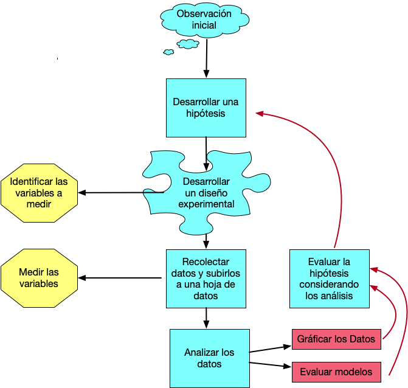

```{r setup, include=FALSE}
knitr::opts_chunk$set(echo = TRUE)
```

# El libro de la clase

[Discovering Statistics using R by Andy Field](https://www.amazon.com/Discovering-Statistics-Using-Andy-Field/dp/1446200469/ref=sr_1_2?keywords=Andy+Field&qid=1565373166&s=gateway&sr=8-2). Click on the title it will send you to Amazon. 

\pagebreak

***********


# El proceso de investigación:

En este curso se estará enfatizando los análisis cuantitativo, esto es simplemente que analizamos los datos para llegar a una conclusión. Naturalmente el proceso de seleccionar los datos puede ser un reto grande. Como uno selecciona los datos y el desarrollo de la investigación depende del diseño experimental. El diseño es el procedimiento de como uno recolecta los datos y como los vamos a analizar.  En este curso no estaremos evaluando métodos cualitativos de análisis. Este método cuantitativo se refiere a evaluar principalmente opiniones, motivaciones o razones que influencia o impacta una situación.  En los métodos cuantitativos es necesario que los resultados sean de una forma o otra numéricos o categóricos.    

El proceso de investigación cuantitativo tiene multiples pasos y podemos visualizar los pasos con un diagrama de flujo. 


```{r echo=FALSE, fig.cap="El proceso de Investigación", out.width = '70%'}

```

***
## El primer paso: 
1. Todo comienza con una pregunta que te llama la intención. Esta pregunta proviene de haber observado tu ambiente. Puede que sea algo muy sencillo (por ejemplo: si la cantidad de estudiantes por salón impacta su rendimiento), o puede ser una pregunta más complicada.  

***
## El segundo paso
2. Es desarrollar una hipótesis. Hay dos tipos de hipótesis, la hipótesis nula y la hipótesis alterna.  SIEMPRE uno comprueba la hipótesis NULA. La nula en la forma más sencilla es que los grupos son iguales.  En otra palabra, si regresamos a la pregunta del primer paso, el rendimiento de los estudiantes irrelevante de la cantidad de estudiantes en el salón es igual. La hipótesis alterna es que "que la cantidad de estudiante en un salón impacta el rendimiento de los estudiantes" 

  * Si se acepta la hipótesis nula esto quiere decir que NO hay evidencia que los grupos sean diferentes
  * Si se rechaza la hipótesis nula es que hay evidencia que los dos grupos sean diferentes. 

## El tercer paso:
3. Ahora hay que definir cual son las variables (datos) que se van a recolectar.  Por ejemplo, cuantos grupos de estudiantes se seleccionará (2, 3, 10 salones?), La información se recolectará de cuantos estudiantes por salones (todos, la mitad, los que se aparece, o se seleccionará los estudiantes al azar, y si seleciona al azar cual es el mecanismo para seleccionarlos de esta forma).  Cual sera el indice de "rendimiento" (el entusiamo de cada estudiante, la nota de un examen, de un trabajo, la nota final). Si se selecciona la nota final la información sera la nota numérica o alfabética (A, B, C, etc).  

Tomando la información anterior en consideración esto determinará el diseño experimental y las pruebas que se deberá utiliza en el quinto paso. 

***

## El cuarto paso:
4. Recolectar los datos. Este se debe hacer de una forma sistemática, con la información bien apuntado y subir la información en una hoja de calculo (spreadsheet), como MS Excel, Google Sheet y Numbers.  

***
## El quinto paso:
5. En este paso se hará los gráficos y los análisis estadísticos para evaluar la hipótesis.

***
## El sexto paso:
6. Aceptar o rechazar la hipótesis NULA. 


## Tipo de error estadístico


El concepto básico en estadística, y probablemente el más extraño a captar para algunos es que en el mundo existe la *verdad*, pero cuando uno recolecta datos, no necesariamente los datos de la muestra representa la *verdad* o sea la realidad.  Por consecuencia siempre hay una posibilidad que los datos nos engaña, y si nos engaña estamos haciendo un error o de rechazar o aceptar la hipótesis. 

Típicamente se rechaza la hipótesis nula si el valor de *p* es menor de 0.05. No es necesario que el valor sea menor de 0.05 para rechazar la hipótesis, en cierta condiciones el valor critico pudiese ser mayor o menor de 0.05.  El valor de *p* represente la proporción de rechazar la hipótesis nula cuando se debería aceptar. Por consecuencia un valor de p = 0.05, significa que hay 5% de probabilidad de rechazar la hipótesis si repetimos la investigación 100 veces. Entonces este representa un tipo de error posible, frecuentemente nominado tipo de error 1 o alfa. En otra palabras significa la probabilidad de rechazar la hipótesis cuando uno debería aceptar la hipótesis.  El otro tipo de error representa el error de aceptar la hipótesis cuando se debería aceptar.  


Aquí un gráfico de los tipos de errores.  El par de graficos 

```{r echo=FALSE, fig.cap="El proceso de Investigación", out.width = '60%'}
knitr::include_graphics("Graficos/Hipothesis_Grid.png")
```
***


Ahora vamos a considerar un ejemplo básico de 

### Consideramos los Reality Shows:

  1. Kardashians
  2. The Bachelorette
  3. Survivors
  4. Big Brother
  5. Shark Tank
  6. Skin Wars
  7. Hell's Kitchen
  
###  Que lo que hay de comun en el tipo de personalidad de las personas en estos programas?
  
***

Narcissistic personality disorder: synonim: Megalomania
with a long-term pattern of abnormal behavior characterized by exaggerated feelings of self-importance, excessive need for admiration, and a lack of empathy.

***

  Una hipotesis es que los productores de estos Reality Shows selecionan gente con caracteristicas de NPD más a menudo. Podemos comprobar esto recolectando datos de los que solicitan y los que fueron aceptado o no a participar en en uno de estos Reality Show (Big Brother = UK)
  
  Se entrevistaron 7662 personas para selecionar 12, a cada uno se le hizo una prueba si tenia simtomas de NPD.  
  ***
  
|             | No NPD | NPD | Total |
|-------------|--------|-----|-------|
| Selecionado |      3 |   9 |    12 |
| Rechazado   |   6805 | 845 |  7650 |
| Total       |   6808 | 854 |  7662 |
  
***


# Cuando que una hipotesis no es una hipotesis?
  
  
***

## Una teoria tiene que ser falsificable


1. Lin Manuel es el mejor actor del mundo
2. El Profesor Tremblay da la mejor clase en la UPRH
3. El aumento en producción de semillas en una planta X aumenta el tamaño poblacional
4. Los Beatles vendieron más discos que cualquier otro grupo artistico. 


***

Variables Independientes y Dependientes

 -La variables Independiente: es la *causa*
 
      - Predictor variable 

 -La variable Dependiente: es la variable que recibe el efecto

      - Outcome Variable 

***

Niveles de mediciones


- Continua
  - Son valores que son continuos o por por lo mennos existe los valores intermedios
  - la distancia entre el valor 13 y 15 y igual que 101 y 103, hay dos unidades que los separa. 
  
        - Numeros de hijos por familia (0, 2, 5, 3, 8, 4)
        

- Categorica o Discreta
- Variables Nominales

          - Hombres y Mujeres
          - Omnivoro, vegetariano, vegan, carnivoro
          
 - Variable Ordinal
      - hay un orden en los valores
      
      
           - primero, segundo, tercero
           - A, B, C, D, F
 
- Variable Binomial
  - Tiene solamente dos altenativas
  
        - Vivo o muerto
        - Vive en PR o No vive en PR
        - Esta embrazada o No esta embarazada

***

```{r}
bebe=c(2,2,0,1,7,5,3,14)
mean(bebe)
median(bebe)
```


```{r}
gender=c("f","f","m","f","m","m","f","f")

bebe
gender

ElF_PR=data.frame(bebe, gender)
ElF_PR

mean(ElF_PR$bebe) # este es la manera de calcular el prmoedio en un data frame
```
Suma(ni)/n

```{r}
mean(bebe)
median(bebe)
```


```{r}
age=c(20,20,20,20,27,21,21,19,22,21,21,19,21,19,22,26,20,20,19,19,19,19,21, 100)
age
mean(age)
median(age)

```

```{r}
belleza= c(22,40,53,57,93, 98, 103, 108,116,121,121, 252)
belleza
median(belleza)
mean(belleza)
```


                        
                        
                        
                        
##---- Al principio

#Basic Math

#4.1 Basic Math

```{r}
1+1

1+1+3+4

1-1

1*2*(1+34)

1/2

2^2 # accent circonflex
factorial(3)
sqrt(2)    # square root 

4*(3+2)^4  
```


#4.2 variables
#4.2.1 Assigning a variable

```{r}
x=3

x
y=5
y
x*y

m=c(1,2,3,4,5,6,7,8,9,9)
m
n=c(2,3,4,5,6,7,8,9,9,10)
suma=m+n
suma
m*n
m-n
m^n
length(m)  # counts the number of data points
length(n)
length(ElF_PR$bebe)
```

#4.2.2 REMOVING A VARIABLE
```{r}

b=6666
b
rm(b) # rm=remove
#b
```


                        
```{r}

mean(age)
median(age)
```


#4.3 Data type


#4.3.1 Numeric Data


#4.3.2. Character Data


#Dates
# Objects are represented as number of days or seconds since January 1, 1970
```{r}
fecha1=as.Date("2012-06-28")
fecha2=as.Date("2012-06-30")
fecha3=as.Date("1970-01-01")
fechaold=as.Date("1969-01-01")
fecha1
fecha2
fecha3
fechaold
as.numeric(fecha1)   # Day zero is January 1, 1970
as.numeric(fecha2)
as.numeric(fecha3)
as.numeric(fechaold)

fecha4=as.POSIXct("2012-06-28 17:42:00")
fecha5=as.POSIXct("2012-06-30 17:42:01")
fecha6=as.POSIXct("1970-01-01 00:01")
fecha4
fecha5
fecha6
as.numeric(fecha4)  # los valores en segundos
as.numeric(fecha5)
as.numeric(fecha6)
```


#Logical
#True = 1
#False = 0

```{r}

TRUE*5
FALSE*5
FALSE+7
TRUE+7
```
## Thus
# does x == y?
```{r}
x=3
x
y=5
y
x==y
m=c(1:10)
m
n=c(1,2,4:12)
n
m

m==n

```
# does x != 3 , "does not"

```{r}
2!=3
m!=n
x!=3
x

2<3
m>=n

```
#Vectors

# c()


#Vector Operations
```{r}
n
n*3
sqrt(n)
#x=c(1,2,3,4,....)
x=1:10
d=1:100
x
d
e=x^2^2
e
```

```{r}
z=c(1,2,NA, 8, 3, NA,3)
z
is.na(z)

zChar=c("Hockey", NA, "Volley")
zChar
is.na(zChar)
```

# Chapter 5

#5.1 data.frame
#create 3 vectors

```{r}

x=10:1
x
y=-4:5
y
q=c("Fajardo", "Carolina", "Luquillo","Gurabo", "Rio_Grande", "Ceiba","Las_Piedras", "Caguas","Maunabo", "Sturgeon_Falls")
q

theDF=data.frame(x,y,q)  # create the data frame
theDF
```

# change the name of the columns
```{r}
theDF=data.frame(First=x, Second=y, Municipio=q)
theDF

nrow(theDF) # the number of rows
ncol(theDF)  # the number of columns

dim(theDF) # the dimension of the data.frame

names(theDF) # the name of the columns

names(theDF)[2:3] # the name of the third column

rownames(theDF)   # the name of the rows

head(theDF)   #first 6 lines

tail(theDF)   # last 6 lines

head(theDF, n=8)   #first 8 lines

class(theDF) 
class(d)
```

# list are an object of the same type of information or different information
#creates a three element list
```{r}
list(1,2,3)


#creates a single element list where the only element is a vector that has three elements
list(c(1,2,3))

(list3=list(c(1,2,3),3:7))

list(theDF, 11:20)
```

# Matrices is similar to a data.frame, however all the elements are of the same type, for example all numeric

```{r}
A=matrix(1:10, nrow=5)
A
B=matrix(21:30, nrow=5)
B

A+B
A*B
A==B
A<B
```
# Matrix multiplication

```{r}
A%*%t(B)
```
