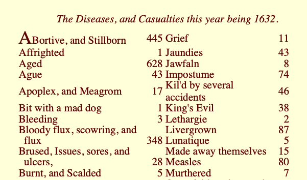

```{r setup, include=FALSE}
knitr::opts_chunk$set(echo = TRUE, warning=FALSE, message = FALSE)
```s

Fecha de la ultima revisión
```{r echo=FALSE}

Sys.Date()
```


## Definición de lo que es la estadística

La estadística es un área de la ciencia de datos que utiliza valores numéricos para evaluar patrones y inferir situaciones futuras. Esta definición es sencilla, pero incluye muchos temas pero lo más importante es el componente de utilizar datos, resumiendo estos en indices o parámetros y utilizar estos para predecir el futuro.  La palabra estadística usado en el termino más o menos similar a su definición de hoy probablemente origina del alemán *Statistik* por Gottfried Achenwall (1749).  Donde el termino era para la descripción de datos del estado. Es solamente en 1791 por Sir John Sinclair que el termino comenzó a ser utilizado para la descripción de conjuntos de datos en general sin ser limitado a datos de un estado/pais.      


## Introducción a la Historía de la Estadística. 

Al principio en el siglo 18 el termino estadística era designar la colección información sobre la población y la economía de diferentes regiones o países.  En este periodo el objetivo era tabular la información, por ejemplo cuanta gente en un área, cuantas vacas hay, cuanta gente son parte de la nobleza.  

Por ejemplo uno de las primeras encuesta para determinar fue hecha por John Gaunt (1662) titulado **Natural and Political Observations Made upon the Bills of Mortality** y puede encontrar el libro aquí <http://www.neonatology.org/pdf/graunt.pdf>. En el libro expone que 1/3 parte de los niños antes de la edad de 16 mueren en Londres, Inglaterra. 

Aquí un extracto de una de estas tablas de las causas de enfermedades y mortandad en Londres en el año 1632.  Note que antes de este trabajo esto datos era bien raro y ni existente en la mayoría de las ciudades o países. 

Note algunos causas principales de mortandad, "Aged" (628), que la persona es de edad mayor, y "Abortive and Stillborn" que natimuerto (445).   Algunos se considerara raros hoy en día es morir de "grief" o sea de tristeza (11). 

.    
```{r echo=FALSE, fig.cap="El proceso de Investigación", out.width = '70%'}

```

El otro componente importante de la estadística fue el desarrollo de las probabilidades en el siglo 17 y 18.  La gente le gustaba (como hoy en día) hacer apuestos y jugar cartas para dinero. Entonces hubo un mucha gente tratando de entender las diferentes probabilidades de ganar en estos juegos de azar.  


## Algunos personas importantes


## Dessarollo tematico 


## Dessarollo temporal 


